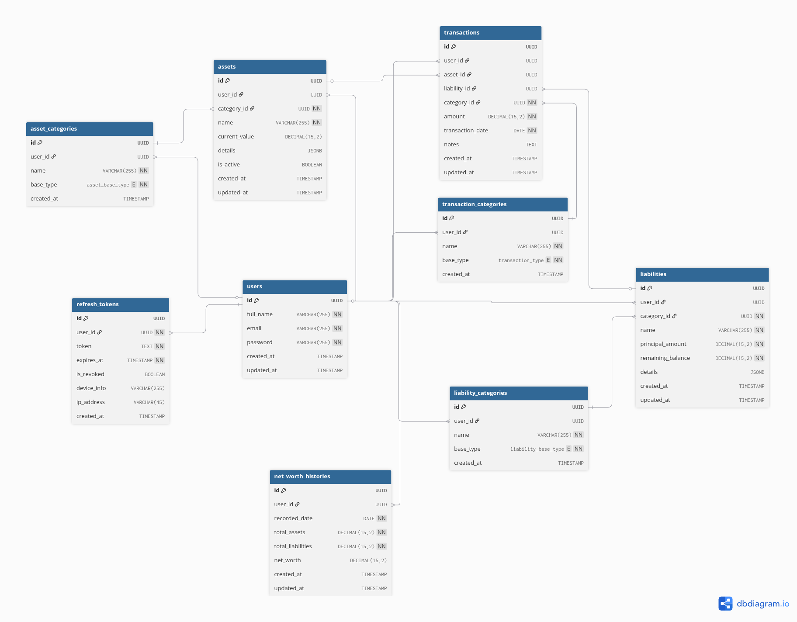

# Fintrack BE

###### Fintrack BE

FinTrack BE is a backend application for managing assets, liabilities, and personal finance tracking.

## Technology Stack

`Go Programming Language` `PostgreSQL`

## Features

- User Registration
- User Login
- Refresh Token

## Database Design



## Demo

**LIVE API** : `https://link-to-live-api`  
**API Documentation** : `https://link-to-api-docs`

## Installation

Follow these steps to install and run Fintrack BE on your local machine:

1. **Clone the repository:**

   ```bash
   git clone https://github.com/fazriegi/fintrack-be.git
   ```

2. **Move to cloned repository folder**

   ```bash
   cd fintrack-be
   ```

3. **Update dependecies**

   ```bash
   go mod tidy
   ```

4. **Copy `.env.example` to `.env`**

   ```bash
   cp .env.example .env
   ```

5. **Configure your `.env`**
6. **Migrate the db migrations**
7. **Build and Run the app**

   ```bash
   make run
   ```

## Running with Docker (Recommended)

You can run the entire application stack (Go backend and PostgreSQL database) using Docker and Docker Compose.

### Prerequisites

Make sure you have [Docker](https://docs.docker.com/get-docker/) and [Docker Compose](https://docs.docker.com/compose/install/) installed.

### Steps to Run

1. **Build and start the containers:**
   ```bash
   docker compose up --build -d
   ```
   *Note: This will spin up PostgreSQL, automatically run the schema migrations from `db/migrations/postgres.sql`, build the optimized multi-stage Go backend image, and start the API server.*

2. **Check container status:**
   ```bash
   docker compose ps
   ```

3. **View logs:**
   ```bash
   docker compose logs -f
   ```

4. **Stop the containers:**
   ```bash
   docker compose down
   ```

5. **Stop and remove database volumes (clean reset):**
   ```bash
   docker compose down -v
   ```

## Author

Fazri Egi - [Github](https://github.com/fazriegi)
