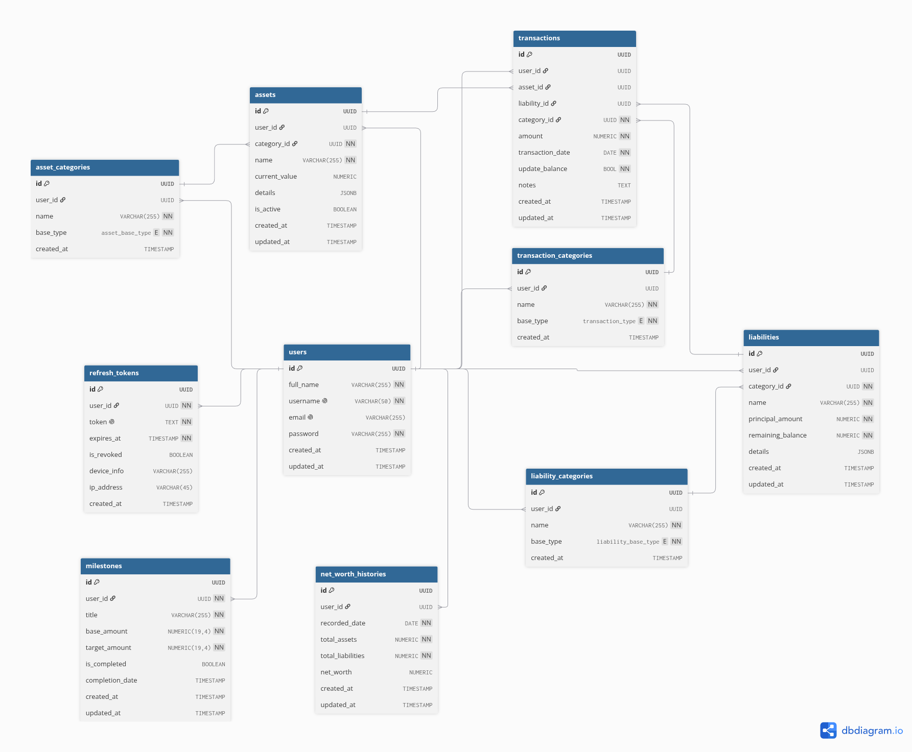

# NetBase BE

###### NetBase BE

NetBase BE is a backend application for managing assets, liabilities, and personal finance tracking.

## Technology Stack

`Go Programming Language` `PostgreSQL`

## Features

- User Registration
- User Login
- Refresh Token

## Database Design



## Demo

**LIVE API** : `https://link-to-live-api`  
**API Documentation** : `https://link-to-api-docs`

## Installation

Follow these steps to install and run NetBase BE on your local machine:

1. **Clone the repository:**

   ```bash
   git clone https://github.com/fazriegi/netbase-be.git
   ```

2. **Move to cloned repository folder**

   ```bash
   cd netbase-be
   ```

3. **Update dependecies**

   ```bash
   go mod tidy
   ```

4. **Copy `.env.example` to `.env`**

   ```bash
   cp .env.example .env
   ```

5. **Configure your `.env`**
6. **Migrate the db migrations**
7. **Build and Run the app**

   ```bash
   make run
   ```

## Running with Docker (Recommended)

You can run the entire application stack (Go backend and PostgreSQL database) using Docker and Docker Compose.

### Prerequisites

Make sure you have [Docker](https://docs.docker.com/get-docker/) and [Docker Compose](https://docs.docker.com/compose/install/) installed.

### Steps to Run

1. **Copy `.env.example` to `.env`**

   ```bash
   cp .env.example .env
   ```

2. **Configure your `.env`**

3. **Build and start the containers:**

   ```bash
   docker compose up --build -d
   ```

   _Note: This will spin up PostgreSQL, automatically run the schema migrations from `db/migrations/postgres.sql`, build the optimized multi-stage Go backend image, and start the API server._

4. **Check container status:**

   ```bash
   docker compose ps
   ```

5. **View logs:**

   ```bash
   docker compose logs -f
   ```

6. **Stop the containers:**

   ```bash
   docker compose down
   ```

7. **Stop and remove database volumes (clean reset):**
   ```bash
   docker compose down -v
   ```

## CI/CD & Deployment

This backend project uses **GitHub Actions** for automated testing, Docker containerization, and continuous deployment:

### 1. Continuous Integration (CI)
- Workflow file: `.github/workflows/ci.yml`
- Runs on: Every push and pull request to `master` and `development`.
- Validates code integrity with `go mod verify`, `go test -v -race ./...`, and static binary build checks.

### 2. Docker Image & Continuous Deployment (CD)
- Workflow file: `.github/workflows/deploy.yml`
- Runs on: Every push to `master` (or manual trigger via `workflow_dispatch`).
- Builds an optimized multi-stage Docker image and publishes it to **GitHub Container Registry** (`ghcr.io/fazriegi/netbase-be:latest`).
- Connects via SSH to your VPS and runs `docker-compose.prod.yml` to update the backend service with zero downtime.

### Required GitHub Secrets

To enable automated deployment to your VPS, add the following secrets in GitHub (**Settings > Secrets and variables > Actions**):

| Secret | Description |
|---|---|
| `SSH_HOST` | IP address or domain name of your remote VPS |
| `SSH_USER` | SSH username (e.g. `ubuntu`, `root`, or `deploy`) |
| `SSH_KEY` | Private SSH key for server access |
| `SSH_PORT` | *(Optional)* SSH port (defaults to `22`) |
| `REMOTE_TARGET_DIR` | *(Optional)* Directory on server (defaults to `~/netbase-be`) |

### Production Deployment on Server

On your VPS, place `docker-compose.prod.yml` and `.env` in your project folder (`~/netbase-be`):

```bash
# 1. Pull the pre-built backend image from GHCR
docker compose -f docker-compose.prod.yml pull web

# 2. Start all services (Database, Migrations, and Backend API)
docker compose -f docker-compose.prod.yml up -d

# 3. View running container logs
docker compose -f docker-compose.prod.yml logs -f web
```

## Author

Fazri Egi - [Github](https://github.com/fazriegi)
